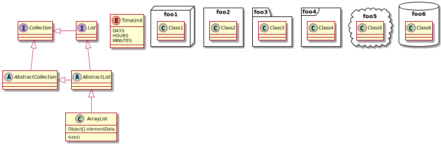

= Server

A monolith spring boot code base.

==== **to test the app**
Open terminal and run : ```./gradlew :server:check```

==== **to BDD test the app**
Open terminal and run : ```./gradlew :server:cucumber```

==== **to run the app**
Open terminal and run : ```./gradlew :server:bootRun``` +
and launch http://localhost:8080/


=== server classes diagram :
